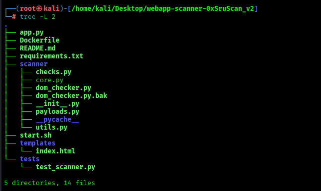
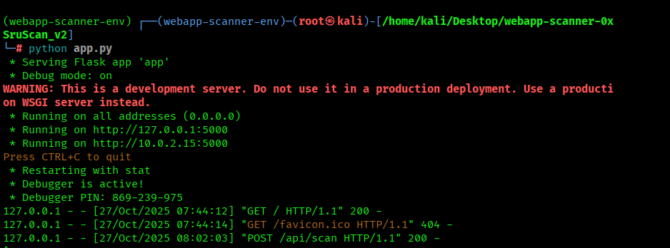

# webapp-scanner-0xSruScan

Minimal web application vulnerability scanner (educational). Tests for reflected XSS, naive SQLi, missing CSRF tokens, and missing security headers.

## DOM XSS
This version includes a DOM XSS headless verifier using Playwright. To run the verifier you must install Playwright browsers as shown below.

**Usage**

1. Create a virtualenv and install dependencies:

```bash
pyenv install 3.12.7
curl https://pyenv.run | bash
--------------------------------
#Add the following to ~/.bashrc (or ~/.zshrc if using zsh):

export PATH="$HOME/.pyenv/bin:$PATH"
eval "$(pyenv init --path)"
eval "$(pyenv init -)"
eval "$(pyenv virtualenv-init -)"
--------------------------------------
#Then reload the shell:

source ~/.bashrc (or ~/.zshrc if using zsh)
--------------------------------------
pyenv virtualenv 3.12.7 webapp-scanner
pyenv activate webapp-scanner
```

2. Install Playwright browser binaries:

```bash
python -m playwright install chromium
```

3. Run the app:

```bash
python app.py
```

4. Open `http://127.0.0.1:5000` and enter a target (for testing use OWASP Juice Shop on port 3000).

**Notes**
- Only scan targets you own or have explicit permission to test.
- This is a learning project — results are noisy and not exhaustive.


## 📸 Screenshots

### Project Overview


### Running Flask Server


### Web Interface


### Scan in Progress


### Scan Results

